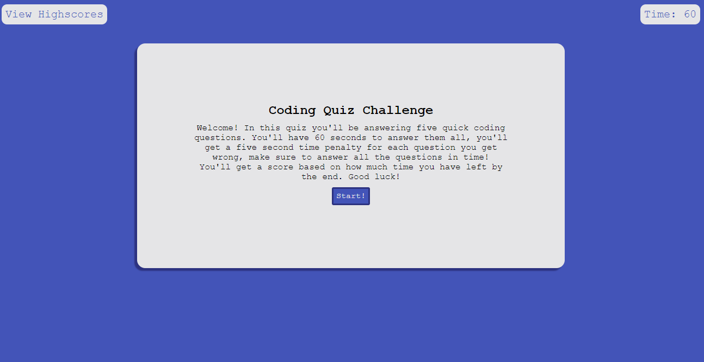
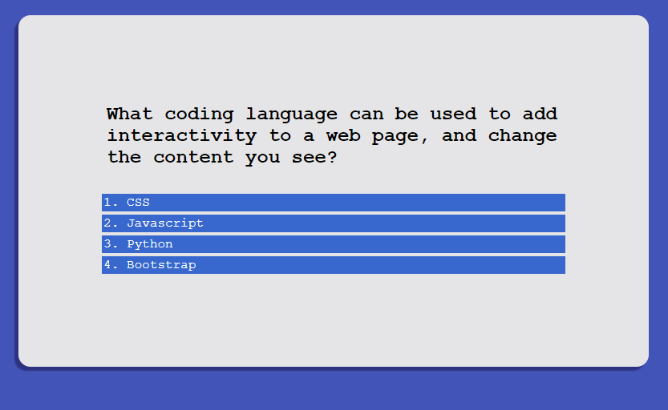
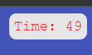
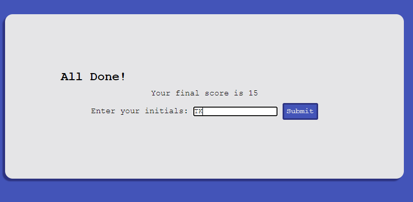
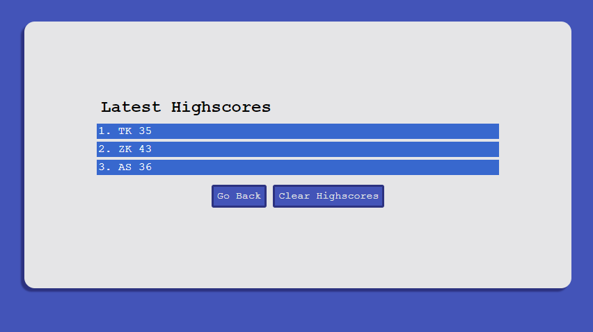

# Week 4: Dynamic Web Coding Quiz

## Description

For our fourth weekly assignment for our web development program, we were tasked with creating a demo for a timed, dynamic coding quiz from the ground up. The overarching lesson from this assignment is to get a handle on how Javascript can interact with an HTML doc, and how Javascript can change the content of the page. 

The main features we were to implement were the main quiz element that cycles through questions after every answer, feedback and an audio cue on if the user's answer was correct or not, and a way for the user to enter their name and save a highscore that's stored in local memory.

While these "start from boilerplate HTML" type assignments are always intimidating, my approach was to start with the most prominent features and branch outwards. The first crucial step to projects like these is to always recognize what the main feature needs to be. What I worked on first was the ability to start the test, populate an OL element with LI elements that drew their text content from a "question" object. That worked for creating a relationship between the start screen and the questions themselves. Then using a function that took a currentQuestion variable, repopulates the text content of the list elements with the new questions. What I also realized from the beginning is that each distinct page can have its own populate function. So I created a function that changes text content and display values for the start page, question page, highscore entry page, and the highscore page itself. Finally, to give the question onClick elements the ability to check if their text content is the right answer, another check is implemented to compare the "correct" string with its current string. Depending on the answer, it either calls a "right answer" function, or a "wrong answer" function.

So the questions now worked, next was to implement a highscore screen that removed all the OL children and displayed an input field that allowed a user to enter their name. Their name would then be stored in an array with their score (the timer's final value) and displayed on the highscores page. I was able to reuse the function that created the questions to display any number of highscores using a for loop. A simple way to store and display the highscore array was to recognize that the user's name would be stored in an even numbered spot, and their score would be stored in the next odd number spot. So instead of having to juggle two different arrays, we can just call the array twice in a row for each for loop. Finally, on the highscore screen there are two buttons that can take the user back to the start page using that page's population function, or the user can clear the highscore array.

Finally, after all this work, implementing the timer was fairly easy as I already had all the functions to display each "page" that I needed. So upon starting the test, a timer starts. If that timer reaches 0, the test immediately jumps to the highscore entry page, even displaying a unique header to let the user know that they ran out of time. Then, to add a penalty to getting a wrong answer, I adjusted the scope of the timer to allow for the "wrong answer" function to deduct from the timer. The timer even turns red to signify that time was taken off. All that was left to do was to make the highscore array persist between reloads using JSON.stringify and JSON.parse. 

## Installation

N/A Already deployed on GitHub pages. 
(url)

## Usage
In order to start the test, click the 'Start!" button. This will display the questions and activate a timer.

To pick whichever answer you want, hover over one of the list elements (it will lighten slightly) and click on it.

You'll notice that depending on if your answer was correct or incorrect, a small message will be displayed underneath the questions. along with a sound effect (if supported by your browser.) If your answer was wrong, the timer will turn red and you will have 5 seconds deducted.

Once you have made it through, you'll be directed to a highscore entry screen that displays how well you did. You can enter your name or initials here, if you do not enter anything, your score will be entered under "AA".

After submitting your name, your score will be stored on the highscore screen. This screen can also be accessed from the main screen via the Highscores button in the upper left.
If desired, you can also view the highscores while taking the test, although this will stop the timer and your current progress will be lost.

Good luck and have fun! How high of a score can you get?

## License

Standard MIT license, coursework.